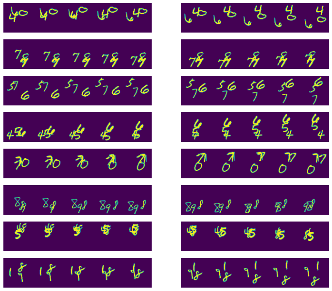
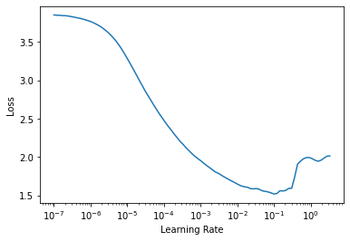
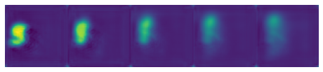

# Moving MNIST forecasting
> A little experiment using Convolutional RNNs to forecast moving MNIST digits.


```python
from fastai.vision.all import *
from moving_mnist.models.conv_rnn import *
from moving_mnist.data import *
```

```python
if torch.cuda.is_available():
    torch.cuda.set_device(0)
    print(torch.cuda.get_device_name())
```

    Quadro RTX 8000


## Install

It only uses fastai (version 2) as dependency. Check how to install at https://github.com/fastai/fastai2

## Example:

We wil predict:
- `n_in`: 5 images
- `n_out`: 5 images  
- `n_obj`: 3 objects

```python
ds = MovingMNIST(DATA_PATH, n_in=5, n_out=5, n_obj=[1,2,3])
```

```python
train_tl = TfmdLists(range(500), ImageTupleTransform(ds))
valid_tl = TfmdLists(range(100), ImageTupleTransform(ds))
```

```python
dls = DataLoaders.from_dsets(train_tl, valid_tl, bs=8,
                             after_batch=[Normalize.from_stats(*mnist_stats)]).cuda()
```

Left: Input, Right: Target

```python
dls.show_batch()
```





`StackUnstack` takes cares of stacking the list of images into a fat tensor, and unstacking them at the end, we will need to modify our loss function to take a list of tensors as input and target.

```python
model = StackUnstack(SimpleModel())
```

As the `ImageSeq` is a `tuple` of images, we will need to stack them to compute loss.

```python
loss_func = StackLoss(MSELossFlat())
```

```python
learn = Learner(dls, model, loss_func=loss_func, cbs=[])
```

```python
learn.lr_find()
```


    SuggestedLRs(lr_min=0.005754399299621582, lr_steep=3.0199516913853586e-05)





```python
learn.fit_one_cycle(4, 1e-4)
```


<table border="1" class="dataframe">
  <thead>
    <tr style="text-align: left;">
      <th>epoch</th>
      <th>train_loss</th>
      <th>valid_loss</th>
      <th>time</th>
    </tr>
  </thead>
  <tbody>
    <tr>
      <td>0</td>
      <td>0.915238</td>
      <td>0.619522</td>
      <td>00:12</td>
    </tr>
    <tr>
      <td>1</td>
      <td>0.669368</td>
      <td>0.608123</td>
      <td>00:12</td>
    </tr>
    <tr>
      <td>2</td>
      <td>0.570026</td>
      <td>0.559723</td>
      <td>00:12</td>
    </tr>
    <tr>
      <td>3</td>
      <td>0.528593</td>
      <td>0.532774</td>
      <td>00:12</td>
    </tr>
  </tbody>
</table>


```python
p,t = learn.get_preds()
```


As you can see, the results is a list of 5 tensors with 100 samples each.

```python
len(p), p[0].shape
```


    (5, torch.Size([100, 1, 64, 64]))


```python
def show_res(t, idx):
    im_seq = ImageSeq.create([t[i][idx] for i in range(5)])
    im_seq.show(figsize=(8,4));
```

```python
k = random.randint(0,100)
show_res(t,k)
show_res(p,k)
```





## Training Example:
- ConvGRU with attention and blur upsampling: [01_train_example.ipynb](01_train_example.ipynb)
- ConvGRU trained with Cross Entropy instead of MSE: [02_train_cross_entropy.ipynb](02_train_cross_entropy.ipynb)
- Seq2seq model trianed with MSE [03_trainseq2seq.ipynb](03_trainseq2seq.ipynb)
- PhyDNet ported to fastai[04_train_phydnet.ipynb](04_train_phydnet.ipynb)
